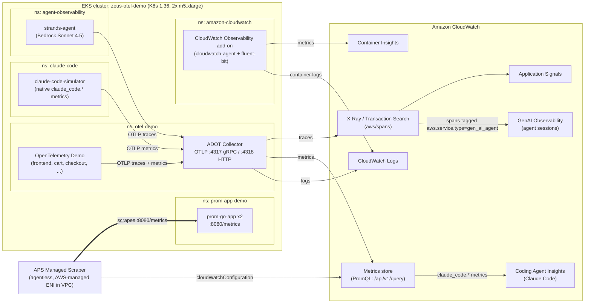

# CloudWatch OTel Demo

An AWS CDK project that stands up an **Amazon EKS** cluster wired end‑to‑end to
**Amazon CloudWatch's OpenTelemetry observability** surfaces. It's a single
`cdk deploy` that demonstrates, on one cluster:

| # | CloudWatch surface | Source workload |
|---|---|---|
| 1 | **Container Insights** (OTel / Enhanced) | CloudWatch Observability EKS add‑on (agent DaemonSet) |
| 2 | **GenAI Observability → Coding Agent Insights (Claude Code)** | `claude-code-simulator` (native `claude_code.*` OTel schema) |
| 3 | **GenAI Observability → Bedrock AgentCore (agents)** | `strands-agent` (Bedrock Sonnet 4.5, `gen_ai_agent` spans) |
| 4 | **X‑Ray / Transaction Search + Application Signals** | OpenTelemetry Demo microservices (Helm) |
| 5 | **PromQL metrics (agentless)** | `prom-go-app` scraped by an **APS managed scraper → CloudWatch** |

All telemetry is tagged with `environment=olympus` for easy filtering.

> **Heads‑up:** this stack runs a real EKS cluster and **costs money** (~$550/mo
> if left running — see [Cost](#cost)). Run `cdk destroy` when you're done.

---

## Architecture



**Reading the diagram:** thin arrows are **push** (OTLP from workloads into the
collector; SigV4 exports from the collector/add-on to CloudWatch). The **thick
arrow is a pull** — the managed scraper reaches into the cluster and scrapes
`prom-go-app`, then writes those metrics to CloudWatch. Application Signals,
GenAI Observability, and Coding Agent Insights are **views derived** from the
spans / metrics already ingested (X-Ray span store and the metrics store),
not separate ingestion paths.

Key design decisions (see [docs/ARCHITECTURE.md](docs/ARCHITECTURE.md) for the full rationale):

- **No IRSA / no OIDC provider.** Every pod uses the **node instance role via
  IMDS**. This avoids a CDK OIDC custom-resource bug, but requires the node
  **IMDS hop limit = 2** (pods are one network hop from IMDS). See
  [Troubleshooting](docs/TROUBLESHOOTING.md).
- **One shared ADOT collector** (`otel-demo` ns) fans telemetry out to X‑Ray,
  CloudWatch metrics, and CloudWatch Logs with SigV4 auth.
- **Managed ("agentless") scraper** runs in AWS, scrapes pods over the VPC, and
  writes straight to CloudWatch — no in‑cluster Prometheus.

---

## Prerequisites

| Tool | Version | Notes |
|---|---|---|
| AWS CLI | v2 | Credentials with admin-ish permissions in the target account |
| Node.js | 18+ | CDK app runtime |
| CDK CLI | 2.170+ | `npx cdk` is used below (pinned in `package.json`) |
| Docker | Latest, **running** | Builds 3 workload images. On Apple Silicon they build as `linux/amd64` |
| kubectl | 1.36+ | Post-deploy cluster access |
| Amazon Bedrock | model access | Enable **Claude Sonnet 4.5** (`us.anthropic.claude-sonnet-4-5-20250929-v1:0`) in the region |
| CloudWatch | Transaction Search **enabled** | Required for X‑Ray span ingestion, Application Signals, and GenAI/AgentCore views |

Enable Transaction Search once per account/region (Console: **CloudWatch →
Application Signals (APM) → Transaction search → Enable**, ingest spans as
structured logs).

---

## Deploy

```bash
npm install

export CDK_DEFAULT_ACCOUNT=<your-account-id>
export CDK_DEFAULT_REGION=us-east-2
export AWS_DEFAULT_REGION=us-east-2

# First time in the account/region only:
npx cdk bootstrap

# ~20-25 min: builds images, creates VPC + EKS + node group + add-ons + workloads + scraper
npx cdk deploy --require-approval never
```

> **Tip:** deploy with `--no-rollback` while iterating so a late failure keeps
> the (expensive, slow) cluster in place for a fast fix‑forward instead of a
> full teardown/rebuild.

---

## Optional: GPU metrics (Container Insights)

Off by default. To also provision a GPU node and a continuous GPU inference
workload — so Container Insights shows NVIDIA GPU metrics (`DCGM_FI_DEV_GPU_UTIL`,
`DCGM_FI_DEV_FB_USED`, `DCGM_FI_DEV_POWER_USAGE`, `DCGM_FI_DEV_GPU_TEMP`, …) —
deploy with the `enableGpu` context flag:

```bash
npx cdk deploy -c enableGpu=true --require-approval never
```

This adds a **1× g4dn.xlarge** (NVIDIA T4, ~$0.53/hr) managed node group, the
NVIDIA device plugin, and a `gpu-inference` workload (a continuous PyTorch
forward-pass loop). The CloudWatch Observability add-on's `dcgm-exporter`
auto-schedules onto the GPU node — no extra config. It reuses the shared launch
template (IMDS hop-limit 2) and the CPU node role.

After enabling, tag the GPU node group's ASG so the account cost-janitor
(SpringClean) doesn't scale it to zero — EKS creates the ASG, so CDK tags don't
reach it (same caveat as the CPU node group, see TROUBLESHOOTING.md):

```bash
ASG=$(aws eks describe-nodegroup --cluster-name zeus-otel-demo --nodegroup-name <gpu-ng-name> \
  --region us-east-2 --query 'nodegroup.resources.autoScalingGroups[0].name' --output text)
aws autoscaling create-or-update-tags --region us-east-2 \
  --tags ResourceId=$ASG,ResourceType=auto-scaling-group,Key=auto-delete,Value=no,PropagateAtLaunch=true \
         ResourceId=$ASG,ResourceType=auto-scaling-group,Key=springclean,Value=do-not-clean,PropagateAtLaunch=true
```

Query the GPU metrics with PromQL, e.g. `cwpromql query '{"DCGM_FI_DEV_GPU_UTIL"}'`.
Delete the GPU node group when idle to stop the hourly cost.

## Post-deploy

### 1. Configure kubectl

```bash
aws eks update-kubeconfig --name zeus-otel-demo --region "$CDK_DEFAULT_REGION"
```

### 2. Grant *yourself* cluster access (operators)

The deploying CloudFormation role gets cluster admin automatically; **your IAM
role does not**. To run `kubectl`, add an access entry for your role:

```bash
MY_ROLE=arn:aws:iam::<account>:role/<your-role>
aws eks create-access-entry  --cluster-name zeus-otel-demo --principal-arn "$MY_ROLE" --type STANDARD --region "$CDK_DEFAULT_REGION"
aws eks associate-access-policy --cluster-name zeus-otel-demo --principal-arn "$MY_ROLE" \
  --policy-arn arn:aws:eks::aws:cluster-access-policy/AmazonEKSClusterAdminPolicy \
  --access-scope type=cluster --region "$CDK_DEFAULT_REGION"
```

> The **managed scraper's** own access entry is created automatically by the
> `CreateScraper` API (the scraper Lambda role has `eks:CreateAccessEntry`). No
> manual step is needed for it.

### 3. Verify everything

```bash
./scripts/verify-telemetry.sh        # pods + a SigV4 PromQL check
```

See [docs/VERIFICATION.md](docs/VERIFICATION.md) for exactly where each signal
shows up in the console and the queries to run.

---

## Workloads

| Workload | Namespace | Demonstrates |
|---|---|---|
| CloudWatch Observability add-on | `amazon-cloudwatch` | Container Insights (OTel), container logs |
| ADOT Collector | `otel-demo` | Shared OTLP pipeline → X‑Ray / CW metrics / CW logs (SigV4) |
| OpenTelemetry Demo (Helm) | `otel-demo` | Distributed tracing across ~15 microservices |
| claude-code-simulator | `claude-code` | Coding Agent Insights (native `claude_code.*` metrics, 5-dev fleet) |
| strands-agent | `agent-observability` | Bedrock agent traces in GenAI Observability |
| prom-go-app (x2) | `prom-app-demo` | Prometheus metrics scraped agentlessly into CloudWatch |
| APS managed scraper | (AWS-managed) | `prometheus.io/scrape` discovery → CloudWatch, queryable via PromQL |

---

## PromQL query explorer

The OTLP metrics (managed-scraper Prometheus metrics + the Claude Code fleet +
OTel SDK self-metrics) are queryable with **PromQL** in
**CloudWatch → Metrics → Query with PromQL (Query Studio)**, or via the SigV4
`monitoring` HTTP API (`scripts/verify-telemetry.sh` shows the signed-request
pattern). Notes on CloudWatch's PromQL dialect:

- Dotted metric names must be quoted: `{"claude_code.token.usage"}`.
- OTel **resource** attributes use an `@resource.` prefix (quote the whole label
  because of the dots): `"@resource.team.id"`. Datapoint attributes (`type`,
  `model`, `method`, `path`, `status`, `decision`, …) are bare.
- The Claude Code counters are **delta** sums — use `sum_over_time(...[1h])` for
  a windowed total and `rate(...[5m])` for a per-second rate.

### Managed scraper — Go app (`prom-app-demo`)

```promql
# Request rate by path and status
sum by (path, status) (rate(http_requests_total[5m]))

# Error ratio (4xx + 5xx)
sum(rate(http_requests_total{status=~"[45].."}[5m])) / sum(rate(http_requests_total[5m]))

# p95 request latency (native OTLP histogram)
histogram_quantile(0.95, rate(http_request_duration_seconds[5m]))

# Average latency by path
histogram_avg(rate(http_request_duration_seconds[5m]))

# In-flight requests per pod
sum by ("@resource.k8s.pod.name") (http_requests_in_flight)

# Scrape-target health for the demo namespace (1 = up)
up{"@resource.k8s.namespace.name"="prom-app-demo"}
```

### Claude Code fleet (GenAI Coding Agent Insights metrics)

```promql
# Token burn rate (tokens/sec) by team
sum by ("@resource.team.id") (rate({"claude_code.token.usage"}[5m]))

# Tokens in the last hour by type (input / output / cacheRead / cacheCreation)
sum by (type) (sum_over_time({"claude_code.token.usage"}[1h]))

# Estimated spend (USD, last hour) by developer
sum by ("@resource.user.name") (sum_over_time({"claude_code.cost.usage"}[1h]))

# Spend by model
sum by (model) (sum_over_time({"claude_code.cost.usage"}[1h]))

# Lines of code added vs removed (last hour)
sum by (type) (sum_over_time({"claude_code.lines_of_code.count"}[1h]))

# Edit-tool decisions: accept vs reject (per-second)
sum by (decision) (rate({"claude_code.code_edit_tool.decision"}[5m]))

# Sessions started (last hour) by team
sum by ("@resource.team.id") (sum_over_time({"claude_code.session.count"}[1h]))

# Commits and PRs across the fleet (last hour)
sum(sum_over_time({"claude_code.commit.count"}[1h]))
sum(sum_over_time({"claude_code.pull_request.count"}[1h]))

# Average cost per session (fleet, last hour)
sum(sum_over_time({"claude_code.cost.usage"}[1h])) / sum(sum_over_time({"claude_code.session.count"}[1h]))

# Tokens by model (last hour)
sum by (model) (sum_over_time({"claude_code.token.usage"}[1h]))
```

### Pipeline / fleet health

```promql
# Spans exported per second by the ADOT collector / SDKs
sum(rate({"otel.sdk.exporter.span.exported"}[5m]))

# Metric data points exported per second
sum(rate({"otel.sdk.exporter.metric_data_point.exported"}[5m]))

# Scrape targets currently down
count(up == 0)
```

## Cost

Roughly **~$330/month** if left running (us-east-2, on-demand) with the default
2-node group:

| Resource | Est. |
|---|---|
| 2× m5.xlarge nodes (default) | ~$220/mo |
| EKS control plane | ~$73/mo |
| 1× NAT gateway + data | ~$35/mo |
| CloudWatch ingestion (spans/metrics/logs) | ~$20–50/mo |

Total pod requests are ~5 vCPU / ~10.5 GiB, which fit 2× m5.xlarge at ~57% CPU /
~34% memory. For more burst headroom or single-node-loss tolerance, bump
`desiredSize` to 3–4 in `lib/zeus-demo-stack.ts` (`maxSize` is 4). **`cdk destroy`
when idle.**

---

## Cleanup

```bash
npx cdk destroy
```

Removes the VPC, EKS cluster, node group, add-ons, IAM roles, managed scraper,
and ECR images. If a delete stalls on the managed scraper, delete it first:
`aws amp delete-scraper --scraper-id <id> --region <region>`.

---

## Repository layout

```
bin/zeus-demo.ts              CDK app entry point
lib/zeus-demo-stack.ts        The whole stack (VPC, EKS, add-ons, workloads, scraper)
workloads/
  claude-code-simulator/      Python: native Claude Code OTel metric schema (fleet)
  strands-agent/              Python: Strands + Bedrock agent, gen_ai spans
  prom-go-app/                Go: Prometheus /metrics endpoint
docs/
  ARCHITECTURE.md             Design decisions + telemetry flows
  VERIFICATION.md             How to confirm each CloudWatch surface
  TROUBLESHOOTING.md          Every gotcha hit while building this (read this!)
scripts/verify-telemetry.sh   One-shot health check
```

## Documentation

- **[docs/ARCHITECTURE.md](docs/ARCHITECTURE.md)** — how telemetry flows and why the design choices were made.
- **[docs/VERIFICATION.md](docs/VERIFICATION.md)** — per-signal console locations and queries.
- **[docs/TROUBLESHOOTING.md](docs/TROUBLESHOOTING.md)** — the full list of issues + fixes (IMDS, IRSA, scraper config, Bedrock model, OTel schema, Helm wiring, …).
