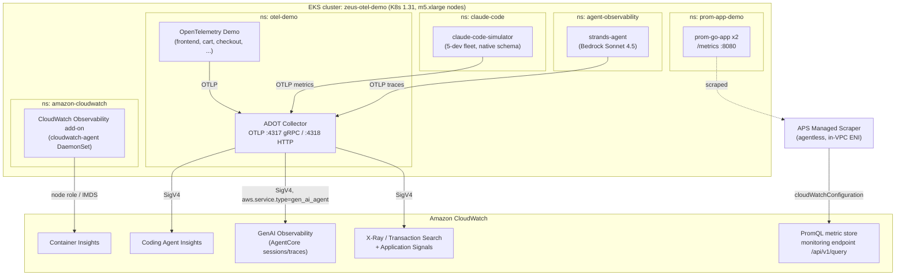

# CloudWatch OTel Demo (Zeus)

An AWS CDK project that stands up an **Amazon EKS** cluster wired end‑to‑end to
**Amazon CloudWatch's OpenTelemetry observability** surfaces. It's a single
`cdk deploy` that demonstrates, on one cluster:

| # | CloudWatch surface | Source workload |
|---|---|---|
| 1 | **Container Insights** (OTel / Enhanced) | CloudWatch Observability EKS add‑on (agent DaemonSet) |
| 2 | **GenAI Observability → Coding Agent Insights (Claude Code)** | `claude-code-simulator` (native `claude_code.*` OTel schema) |
| 3 | **GenAI Observability → Bedrock AgentCore (agents)** | `strands-agent` (Bedrock Sonnet 4.5, `gen_ai_agent` spans) |
| 4 | **X‑Ray / Transaction Search + Application Signals** | OpenTelemetry Demo microservices (Helm) |
| 5 | **PromQL metrics (agentless)** | `prom-go-app` scraped by an **APS managed scraper → CloudWatch** |

All telemetry is tagged with `environment=olympus` for easy filtering.

> **Heads‑up:** this stack runs a real EKS cluster and **costs money** (~$550/mo
> if left running — see [Cost](#cost)). Run `cdk destroy` when you're done.

---

## Architecture



Key design decisions (see [docs/ARCHITECTURE.md](docs/ARCHITECTURE.md) for the full rationale):

- **No IRSA / no OIDC provider.** Every pod uses the **node instance role via
  IMDS**. This avoids a CDK OIDC custom-resource bug, but requires the node
  **IMDS hop limit = 2** (pods are one network hop from IMDS). See
  [Troubleshooting](docs/TROUBLESHOOTING.md).
- **One shared ADOT collector** (`otel-demo` ns) fans telemetry out to X‑Ray,
  CloudWatch metrics, and CloudWatch Logs with SigV4 auth.
- **Managed ("agentless") scraper** runs in AWS, scrapes pods over the VPC, and
  writes straight to CloudWatch — no in‑cluster Prometheus.

---

## Prerequisites

| Tool | Version | Notes |
|---|---|---|
| AWS CLI | v2 | Credentials with admin-ish permissions in the target account |
| Node.js | 18+ | CDK app runtime |
| CDK CLI | 2.170+ | `npx cdk` is used below (pinned in `package.json`) |
| Docker | Latest, **running** | Builds 3 workload images. On Apple Silicon they build as `linux/amd64` |
| kubectl | 1.31+ | Post-deploy cluster access |
| Amazon Bedrock | model access | Enable **Claude Sonnet 4.5** (`us.anthropic.claude-sonnet-4-5-20250929-v1:0`) in the region |
| CloudWatch | Transaction Search **enabled** | Required for X‑Ray span ingestion, Application Signals, and GenAI/AgentCore views |

Enable Transaction Search once per account/region (Console: **CloudWatch →
Application Signals (APM) → Transaction search → Enable**, ingest spans as
structured logs).

---

## Deploy

```bash
npm install

export CDK_DEFAULT_ACCOUNT=<your-account-id>
export CDK_DEFAULT_REGION=us-east-2
export AWS_DEFAULT_REGION=us-east-2

# First time in the account/region only:
npx cdk bootstrap

# ~20-25 min: builds images, creates VPC + EKS + node group + add-ons + workloads + scraper
npx cdk deploy --require-approval never
```

> **Tip:** deploy with `--no-rollback` while iterating so a late failure keeps
> the (expensive, slow) cluster in place for a fast fix‑forward instead of a
> full teardown/rebuild.

---

## Post-deploy

### 1. Configure kubectl

```bash
aws eks update-kubeconfig --name zeus-otel-demo --region "$CDK_DEFAULT_REGION"
```

### 2. Grant *yourself* cluster access (operators)

The deploying CloudFormation role gets cluster admin automatically; **your IAM
role does not**. To run `kubectl`, add an access entry for your role:

```bash
MY_ROLE=arn:aws:iam::<account>:role/<your-role>
aws eks create-access-entry  --cluster-name zeus-otel-demo --principal-arn "$MY_ROLE" --type STANDARD --region "$CDK_DEFAULT_REGION"
aws eks associate-access-policy --cluster-name zeus-otel-demo --principal-arn "$MY_ROLE" \
  --policy-arn arn:aws:eks::aws:cluster-access-policy/AmazonEKSClusterAdminPolicy \
  --access-scope type=cluster --region "$CDK_DEFAULT_REGION"
```

> The **managed scraper's** own access entry is created automatically by the
> `CreateScraper` API (the scraper Lambda role has `eks:CreateAccessEntry`). No
> manual step is needed for it.

### 3. Verify everything

```bash
./scripts/verify-telemetry.sh        # pods + a SigV4 PromQL check
```

See [docs/VERIFICATION.md](docs/VERIFICATION.md) for exactly where each signal
shows up in the console and the queries to run.

---

## Workloads

| Workload | Namespace | Demonstrates |
|---|---|---|
| CloudWatch Observability add-on | `amazon-cloudwatch` | Container Insights (OTel), container logs |
| ADOT Collector | `otel-demo` | Shared OTLP pipeline → X‑Ray / CW metrics / CW logs (SigV4) |
| OpenTelemetry Demo (Helm) | `otel-demo` | Distributed tracing across ~15 microservices |
| claude-code-simulator | `claude-code` | Coding Agent Insights (native `claude_code.*` metrics, 5-dev fleet) |
| strands-agent | `agent-observability` | Bedrock agent traces in GenAI Observability |
| prom-go-app (x2) | `prom-app-demo` | Prometheus metrics scraped agentlessly into CloudWatch |
| APS managed scraper | (AWS-managed) | `prometheus.io/scrape` discovery → CloudWatch, queryable via PromQL |

---

## Cost

Roughly **~$550/month** if left running (us-east-2, on-demand):

| Resource | Est. |
|---|---|
| 4× m5.xlarge nodes | ~$440/mo |
| EKS control plane | ~$73/mo |
| 1× NAT gateway + data | ~$35/mo |
| CloudWatch ingestion (spans/metrics/logs) | ~$20–50/mo |

Reduce to **2 nodes** (~$220/mo saved) by editing `desiredSize`/`minSize` in
`lib/zeus-demo-stack.ts` — total pod requests are ~5.3 vCPU / ~11 GiB, which fits
2× m5.xlarge. **`cdk destroy` when idle.**

---

## Cleanup

```bash
npx cdk destroy
```

Removes the VPC, EKS cluster, node group, add-ons, IAM roles, managed scraper,
and ECR images. If a delete stalls on the managed scraper, delete it first:
`aws amp delete-scraper --scraper-id <id> --region <region>`.

---

## Repository layout

```
bin/zeus-demo.ts              CDK app entry point
lib/zeus-demo-stack.ts        The whole stack (VPC, EKS, add-ons, workloads, scraper)
workloads/
  claude-code-simulator/      Python: native Claude Code OTel metric schema (fleet)
  strands-agent/              Python: Strands + Bedrock agent, gen_ai spans
  prom-go-app/                Go: Prometheus /metrics endpoint
docs/
  ARCHITECTURE.md             Design decisions + telemetry flows
  VERIFICATION.md             How to confirm each CloudWatch surface
  TROUBLESHOOTING.md          Every gotcha hit while building this (read this!)
scripts/verify-telemetry.sh   One-shot health check
```

## Documentation

- **[docs/ARCHITECTURE.md](docs/ARCHITECTURE.md)** — how telemetry flows and why the design choices were made.
- **[docs/VERIFICATION.md](docs/VERIFICATION.md)** — per-signal console locations and queries.
- **[docs/TROUBLESHOOTING.md](docs/TROUBLESHOOTING.md)** — the full list of issues + fixes (IMDS, IRSA, scraper config, Bedrock model, OTel schema, Helm wiring, …).
